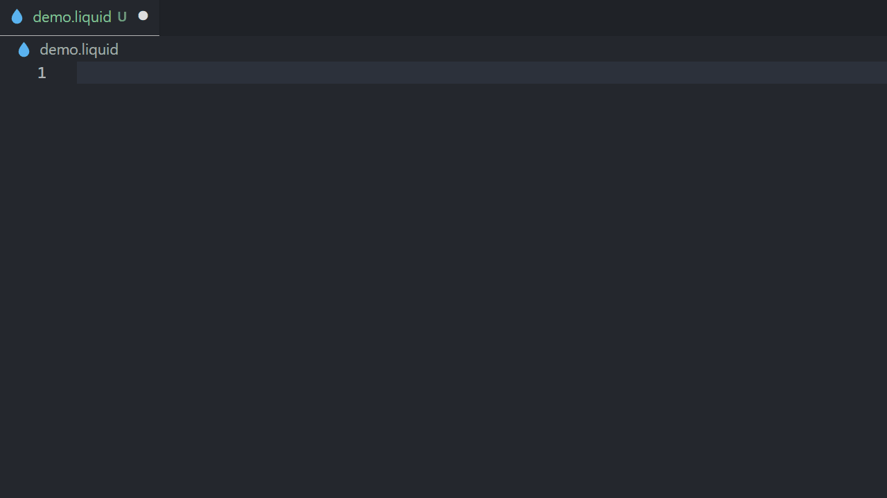

<div align="center">
  

  <h1>Shopify Liquid Snippets for Visual Studio Code</h1>

  <p>A simple but powerful extension to write Liquid in a fast and efficient way.</p>
</div>



## Sponsors

If you enjoy using this extension

<a href="https://www.buymeacoffee.com/waysagency" target="_blank"></a>

## Features

- `` support
- Latest Filters
- Latest Schema settings
- Latest Tags
- Predefined Shopify values (Choice lists)

## Requirements

- [Shopify Liquid](https://marketplace.visualstudio.com/items?itemName=Shopify.theme-check-vscode)

## Extensions to be uninstalled

- [Liquid](https://marketplace.visualstudio.com/items?itemName=sissel.shopify-liquid)
- [Liquid Languages Support](https://marketplace.visualstudio.com/items?itemName=neilding.language-liquid)
- [Shopify Liquid Template Snippets](https://marketplace.visualstudio.com/items?itemName=killalau.vscode-liquid-snippets)

## Emmet

Since Liquid is considered HTML, Emmet needs to know that they need to be associated with each other.

1. Open the Command Palette (`Shift+Command+P` (Mac) / `Ctrl+Shift+P` (Windows/Linux))
2. Type `Open User settings (JSON)` and press enter

Add the following

```
"emmet.includeLanguages": { "liquid": "html" },
```

## Snippets

- Filters
  - Array
  - Cart
  - Collection
  - Color
  - Customer
  - Default
  - Font
  - Format
  - Hosted file
  - HTML
  - Localization
  - Math
  - Media
  - Metafield
  - Money
  - Payment
  - String
  - Tag
- Schema

  - Content
  - Input settings
  - Sidebar settings

- Tags
  - Conditional
  - HTML
  - Iteration
  - Syntax
  - Theme
  - Variable

## Plans

- Only suggest schema settings inside schema tag
- Add markdown documentation with links to the official Shopify docs
